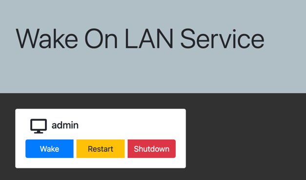

# phpWOL

Let's say you have an office location, internal network only accessible via VPN.   
Your users want to enable users to RDP into their workstations from home.  
You can deploy this webapp on your office's internal server, provide the address to your users so they can wake up 
the workstations, and then shut them down when not in use.



## Features
- Simple web frontend built with Bootstrap & PHP, which can be run on any web server 
  - Tested on IIS, Apache & Nginx
- Wake-on-LAN: Turn on computers remotely that have WoL enabled.
- Shutdown: Remotely shut down Windows computers.
- Restart: Remotely restart Windows computers.

## Requirements
- PHP 8.0+
  - Sockets (for Wake-on-LAN)
  - CURL (for WinRM operations)
- WebServer
- Windows computers with WinRM enabled (for shutdown and restart operations)

## Overview
This webapp allows for remote computer startup, shutdown, and restart operations.

The Wake-on-LAN functionality works by having a PHP server within the network receive a command and then dynamically
generate a WoL packet to specific computers in the same subnet. This circumvents the issue of many routers disabling/ignoring broadcast addresses from outside the local network.

The shutdown and restart functionality uses Windows Remote Management (WinRM) to securely execute commands on remote
Windows machines.
## Configuration

To add or modify hosts, edit the `hosts.php` file. Each host is represented by an associative array with the following keys:

- `hostName`: The name of the host (used for display purposes)
- `macAddress`: The MAC address of the host's network interface
- `ipAddress`: The IP address of the host
- `pw`: The password for remote operations (shutdown/restart)

Example:

```php
$hosts = [
    [
        "hostName" => "computer1",
        "macAddress" => "AA:AA:AA:AA:AA:AA",
        "ipAddress" => "192.168.1.11",
        "pw" => "1234"
    ],
    // Add more hosts as needed
];
```

### Enabling Wake-on-LAN in Windows

1. Open Device Manager
2. Expand "Network adapters"
3. Right-click on your network adapter and select "Properties"
4. Go to the "Power Management" tab
5. Check the box next to "Allow this device to wake the computer"
6. If available, also check "Only allow a magic packet to wake the computer"
7. Click "OK" to save changes

You may also need to enable WoL in your computer's BIOS/UEFI settings.

### Enabling WinRM in Windows

To enable WinRM, run the following commands in an elevated PowerShell:

1. Enable & setup WinRM:
   ```
   winrm quickconfig -q
   
   # Configure WinRM to allow unencrypted traffic (use with caution, consider using HTTPS in production)
   winrm set winrm/config/service @{AllowUnencrypted="true"}
   
   # Allow basic authentication
   winrm set winrm/config/service/auth @{Basic="true"}
   
   # Set trusted hosts to allow connections from any host
   winrm set winrm/config/client @{TrustedHosts="*"}
   ```

2. Restart the WinRM service:
   ```
   Restart-Service WinRM
   ```

Note: These settings are for a basic setup. For production environments, consider using more secure configurations, such as HTTPS and specific trusted hosts.

## Security Note
- When setting up winRM with Basic auth, make **extra** sure that you don't expose the machine on the internet!  
- The passwords stored in hosts.php will be exposed in the source code of index.php. Therefore, these passwords are not secure at all and can be extracted from HTML code. Instead of providing actual security, this approach merely adds an extra step for confirmation to restart/shutdown command.
## Credits
Forked from [castab/phpWOL](https://github.com/castab/phpWOL). Replaced the backend with PHP_WOL developed by [Radovan Janjic](https://radovanjanjic.com)
- Toni Uebernickel <tuebernickel@whitestarprogramming.de>: Original WoL packet generator function
- [Radovan Janjic](https://radovanjanjic.com): PHP_WOL backend
- [vmatt/phpwinrm](https://github.com/vmatt/phpwinrm): Lightweight WinRM client

